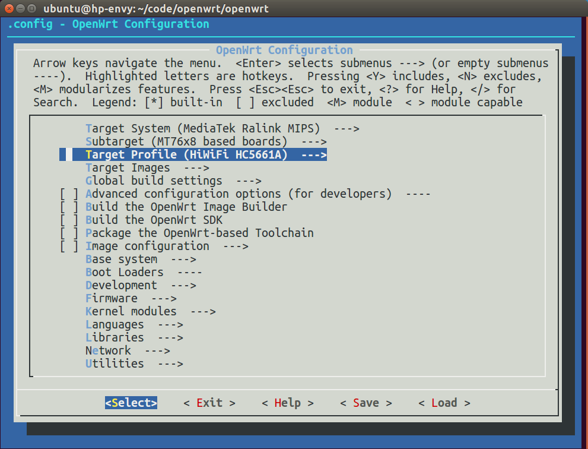
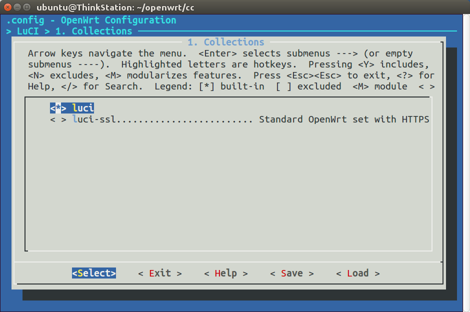
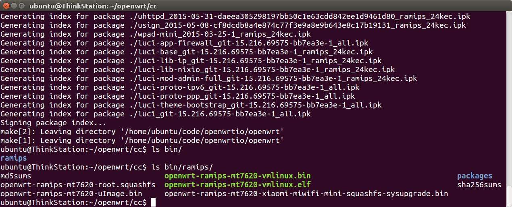
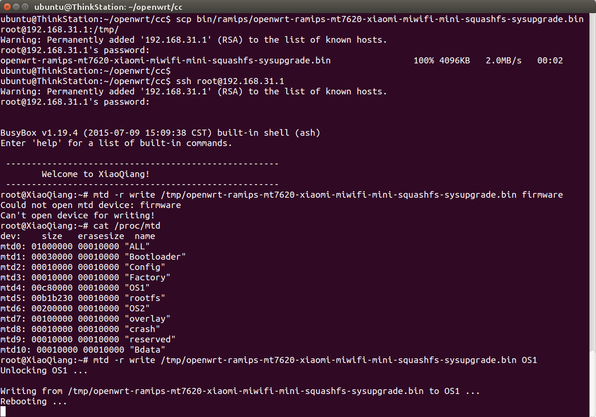
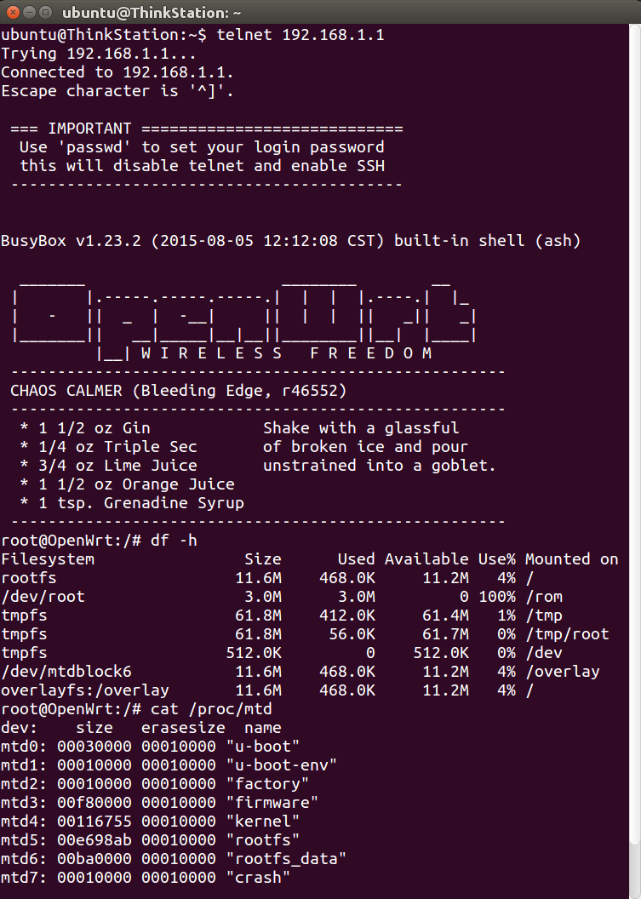

# 编译固件 Build OpenWrt Firmware

如果从网上下载的固件不能满足需求，那就需要自己编译了。

OpenWrt系统已经发布了多个版本，如下：

发布时间 | 版本号 | 开发代号
---------|--------|---------
2017年10月 | 17.01.4 | LEDE
2016年3月 | 15.05.1 | Chaos Calmer
2015年9月 | 15.05 | Chaos Calmer
2014年10月 | 14.07 | Barrier Breaker
2013年4月 | 12.09 | Attitude Adjustment

新的硬件支持和软件都会加入到最新版本中，所以优先使用最新版。

## 下载最新代码

首先把系统代码下载下来，OpenWrt官方代码在[https://github.com/openwrt/openwrt](https://github.com/openwrt/openwrt)，如果下载很慢，可以试试国内镜像：[https://coding.net/u/openwrtio/p/openwrt/git](https://coding.net/u/openwrtio/p/openwrt/git)。如果以前下载过，记得时常更新。指令如下：

```
mkdir -p ~/code/openwrt/dl
cd ~/code/openwrt/
git clone git@github.com:openwrt/openwrt.git
cd openwrt
git pull origin master
ln -s ../dl ./
```

## 查看是否支持手中的路由器

输入命令打开配置界面，搜索品牌或型号（按斜杠/，然后输入），就可以看到OpenWrt是否支持你的路由器了。可以看到已支持：极路由4（HC5962）、极路由3（HC5861）、极路由2（HC5761）、极路由1s（HC5661/HC5661A）、小米路由器mini(已停产)、WRTNode2Q、WRTNode2R、WRTNode2P。

推荐使用价格低廉的 [WRTNode2P（官网￥128）](http://www.wrtnode.cc/) 或 [极路由器1s HC5661A（京东￥89）](https://union-click.jd.com/jdc?e=0&p=AyIOZRprFQITA1AaWCVGTV8LRGtMR1dGFxBFC1pXUwkEAEAdQFkJBVsVAxYCVBhETEdOWmVsW00HZ3kXbjsTAUBTC0UucWpOdx5dVxlsEQZVHUcUBA4HVQpbFwkWBF4eWCUAEwRUH1ocARs3VRtaFQYiN1Uaa0NsEgZUGloUAxoGUitcHAERBV0aWBAyEgJdE10RARAAVhtcHDIVNwZGC0dYRlEDK2slMg%3D%3D&t=W1dCFFlQCxxKQgFHRE5XDVULR0UVAhMDUBpYCltXWwg%3D) 进行开发。

```
cd openwrt
make menuconfig
```

本文以极路由器1s HC5661A为例，它是联发科MT7628芯片，所以Target System选MediaTek Ralink MIPS，Subtarget选MT76x8 based boards，然后进入Target Profile选HiWiFi HC5661A。



## 更新可选的软件源（Feeds）

系统必须的软件是和系统代码集成在一起的，在`package`目录里，而其他可选的软件在各个订阅源里（地址在`feeds.conf.default`里），一般会需要一些，所以进行下载更新，指令如下：

```
./scripts/feeds update -a
./scripts/feeds install -a
```


可以看到，`feeds`目录中出现了很多文件，`package/feeds`里出现了很多软链接指向`feeds`。

## 软件配置

然后再打开配置界面，选择需要的软件（\*是集成到固件里，M是编译成ipk手动安装），然后退出保存。建议取消dnsmasq，集成dnsmasq-full。常用的软件有：

位置 | 用途
-----|-----
Base system > dnsmasq-full > Build with IPset support. | dnsmasq的IPset
LuCI > 1. Collections > luci | 路由器网页管理后台

```
make menuconfig
```




## 编译

使用-j参数开启多核编译，速度会加快。指令如下：

```
make tools/compile -j V=4
make toolchain/compile V=s
make world -j V=4
make -j V=4 | tee build.log
```

如果报错：

> openwrt/staging_dir/toolchain-mipsel_24kec+dsp_gcc-4.8-linaro_uClibc-0.9.33.2/stamp/.toolchain_install] Error 2

可能是因为文件下载失败，需要排查dl目录，去网上搜索文件名，手动下载放进去，并删除`*.dl`文件。指令如下：

```
ls dl/*.dl
rm dl/*.dl
rm dl/*.md5sum
```

然后等待即可。快则几十分钟，慢则几个小时，视CPU性能而定。编译成功后，会在`bin`目录中生成固件，比如小米路由mini的固件是`openwrt-ramips-mt7620-xiaomi-miwifi-mini-squashfs-sysupgrade.bin`。



## 刷机

极路由刷OpenWrt命令如下：

```
scp bin/targets/ramips/mt7628/lede-ramips-mt7628-hc5661a-squashfs-sysupgrade.bin root@192.168.199.1:/tmp/
ssh root@192.168.199.1
mtd write /tmp/lede-ramips-mt7628-hc5661a-squashfs-sysupgrade.bin firmware
reboot
```

小米路由开放root，按照文档开启（[http://miwifi.com/miwifi_open.html](miwifi-install-openwrt-firmware.png)），然后把固件scp进去，刷机。指令如下：

```
scp bin/ramips/openwrt-ramips-mt7620-xiaomi-miwifi-mini-squashfs-sysupgrade.bin root@192.168.31.1:/tmp/
ssh root@192.168.31.1
cat /proc/mtd
mtd -r write /tmp/openwrt-ramips-mt7620-xiaomi-miwifi-mini-squashfs-sysupgrade.bin OS1
```



PS：如果写入firmware报错“Could not open mtd device: firmware”和“Can't open device for writing!”，使用`cat /proc/mtd`查看闪存，改成写入OS1即可。

刷机重启后，就能看到熟悉的OpenWrt路由器界面了，可以看到根目录有11M可写，可以安装各种ipk软件，拯救了小米路由的官方废柴系统，可玩性大大增加。




<div id="comments" data-thread-key="docs-build-firmware"></div>
