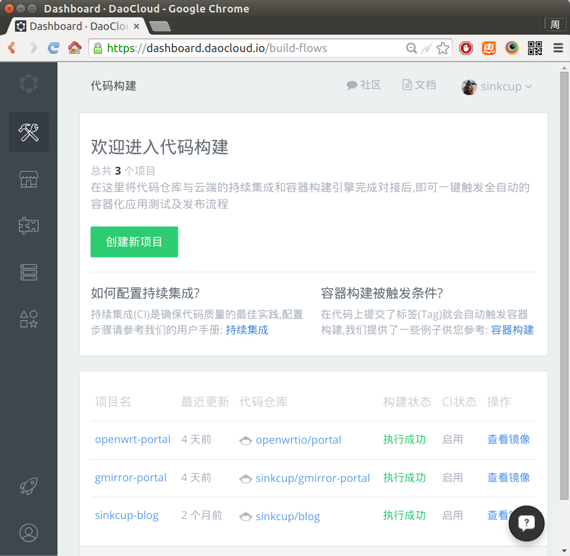
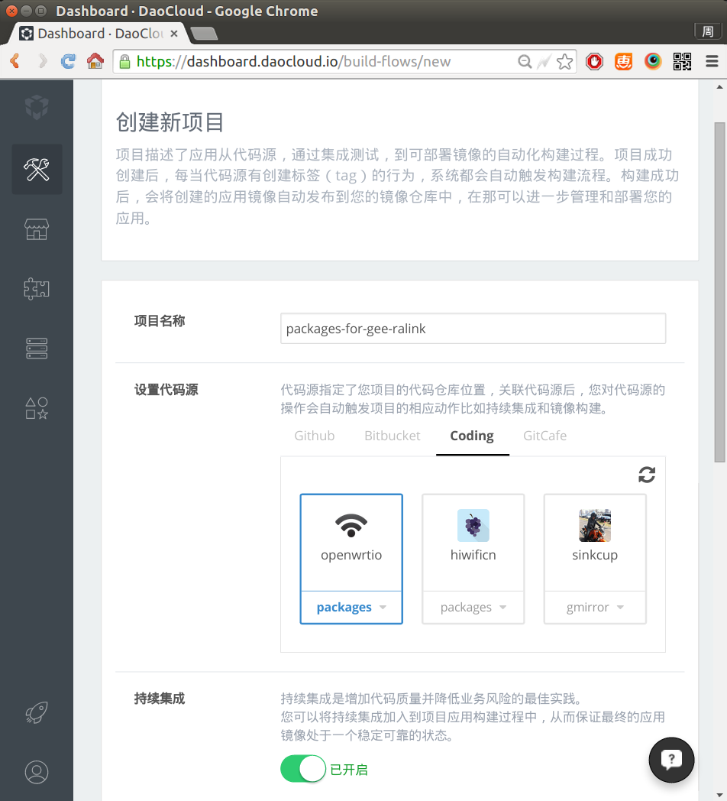
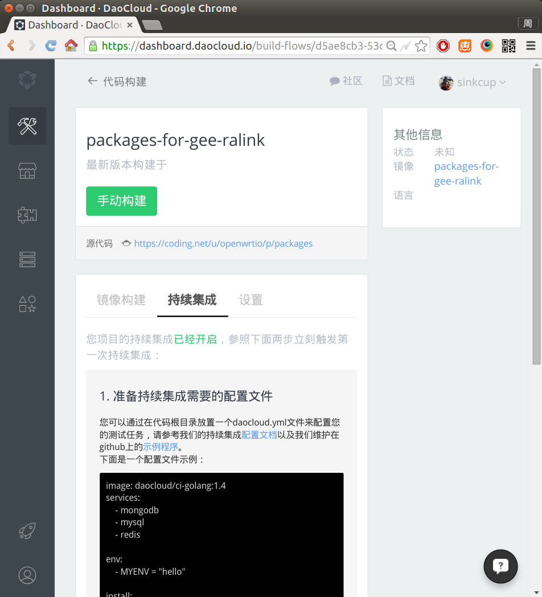
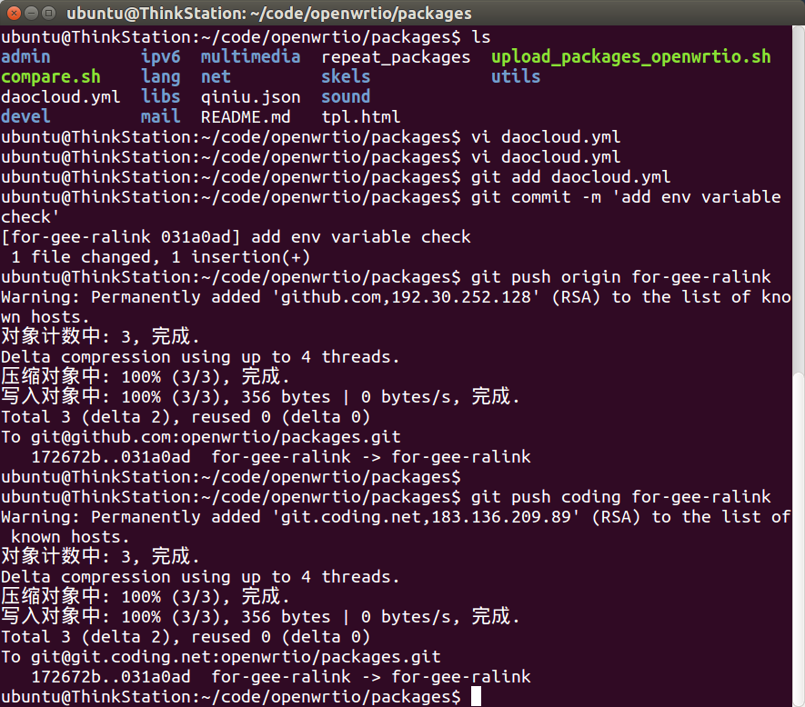
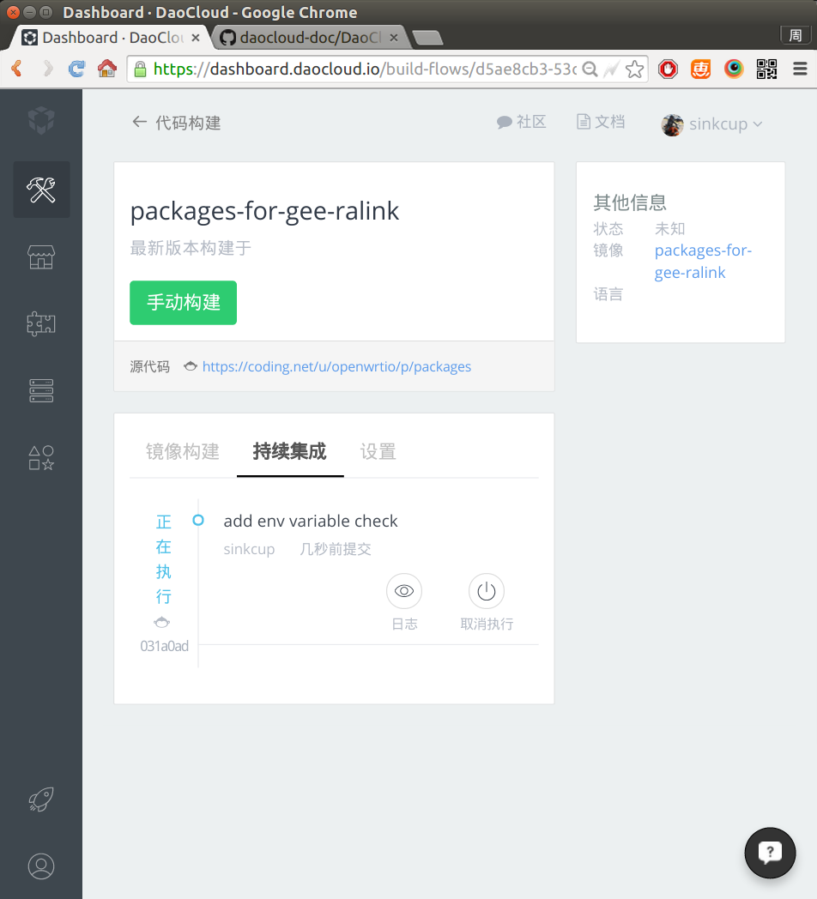
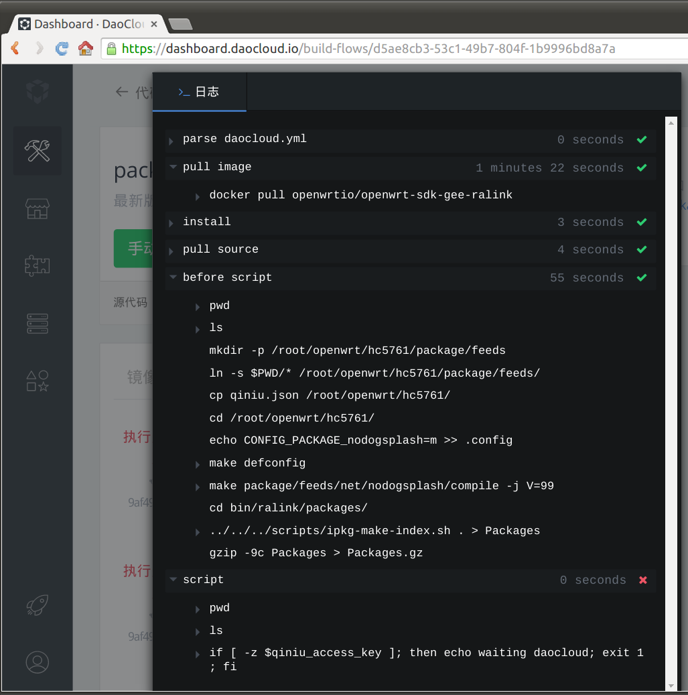

# 使用docker持续集成搭建opkg源

之前的文档[《opkg软件仓库》](/docs/create-opkg-package-repository/)讲解的是手动编译出ipk，然后手动上传到七牛。项目里package较少时，可以这么做。而如果package很多（比如开源项目），开发者经常提交，管理员会来不及编译，所以如果代码提交时触发自动编译自动发布，那就更方便了。git配合持续集成（Continued Integration，CI）可以实现这一点。

常见的git代码托管服务有国际知名的[github.com](https://github.com/)和国内飞快的[coding.net](http://coding.net/)。

常见的CI服务有国际知名的[travis-ci.org](https://travis-ci.org/)和国内飞快的[daocloud.io](https://account.daocloud.io/signup?invite_code=c8bkkhc1uq8i7z8nin93)。travis-ci可被github触发，但不支持docker；daocloud可被github、coding触发，支持docker，所以本文以coding和daocloud为例进行讲解。

## 把代码放到coding.net

在coding.net上创建项目，提交packages代码。比如极路由packages代码在：[https://coding.net/u/openwrtio/p/packages/git/tree/for-gee-ralink/](https://coding.net/u/openwrtio/p/packages/git/tree/for-gee-ralink/)

## 在daocloud创建CI项目

在daocloud.io上创建项目，代码源选择coding的项目。如图：




## 编写daocloud.yml配置CI

创建完项目，会发现并没有自动开始编译，那是因为还没有编写配置文件`daocloud.yml`，按照提示进行编写即可。



比如本项目的`daocloud.yml`在[https://coding.net/u/openwrtio/p/packages/git/blob/for-gee-ralink/daocloud.yml](https://coding.net/u/openwrtio/p/packages/git/blob/for-gee-ralink/daocloud.yml)，内容如下：

```
image: openwrtio/openwrt-sdk-gee-ralink

install:
    - pwd
    - ls
    - wget -O /tmp/qiniu-devtools-linux_amd64-current.tar.gz http://devtools.qiniu.io/qiniu-devtools-linux_amd64-current.tar.gz
    - tar -zxvf /tmp/qiniu-devtools-linux_amd64-current.tar.gz -C /usr/bin/

before_script:
    - pwd
    - ls
    - mkdir -p /root/openwrt/hc5761/package/feeds
    - ln -s $PWD/* /root/openwrt/hc5761/package/feeds/
    - cp qiniu.json /root/openwrt/hc5761/
    - cd /root/openwrt/hc5761/
    - echo 'CONFIG_PACKAGE_nodogsplash=m' >> .config
    - make defconfig
    - make package/feeds/net/nodogsplash/compile -j V=99
    - cd bin/ralink/packages/
    - ../../../scripts/ipkg-make-index.sh . > Packages
    - gzip -9c Packages > Packages.gz

script:
    - pwd
    - ls
    - if [ -z $qiniu_access_key ]; then echo waiting daocloud; exit 1; fi
    - cd /root/openwrt/hc5761/
    - sed -i -e "s|{src}|/root/openwrt/hc5761/bin/ralink/packages/|g" -e "s|{access_key}|$qiniu_access_key|g" -e "s|{secret_key}|$qiniu_secret_key|g" -e "s|{bucket}|dl-openwrt-io|g" -e "s|{key_prefix}|vendors/gee/ralink/packages/|g" qiniu.json
    - qrsync --check-exist qiniu.json
    - qrsctl login $qiniu_user $qiniu_passwd
    - qrsctl cdn/refresh dl-openwrt-io http://dl.openwrt.io/vendors/gee/ralink/packages/Packages.gz
```

可以看到install阶段安装了七牛上传工具，before_script阶段编译了package并生成索引，script阶段上传到七牛。

把`daocloud.yml`提交git，将会触发持续集成。如图：





可以看到install、before_script都执行成功了，但上传到七牛时出错了，这是因为环境变量里缺少七牛密码，只能等daocloud做好网页环境变量时，才可以。大家可以关注[DaoCloud的微博](http://weibo.com/u/5424712657)。

<div id="comments" data-thread-key="docs-create-opkg-package-repository-using-docker-ci"></div>
